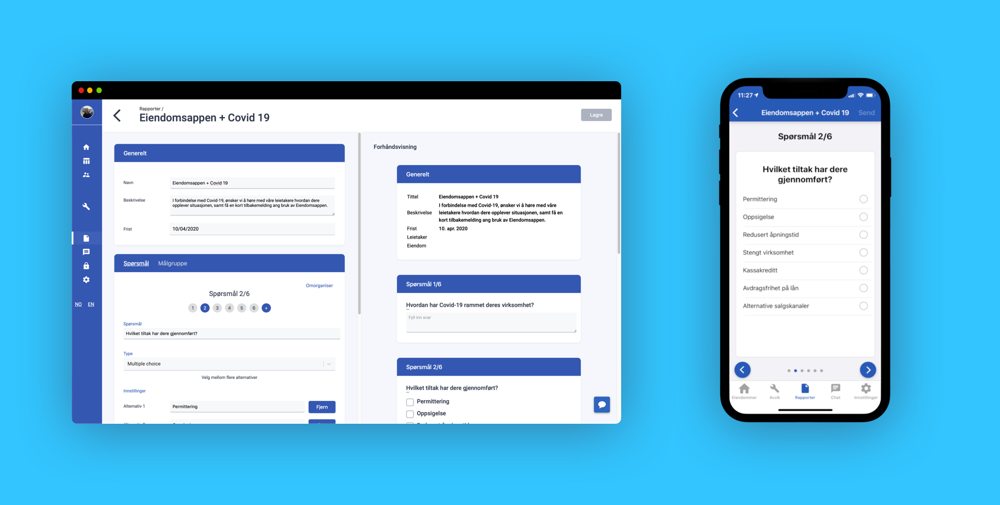
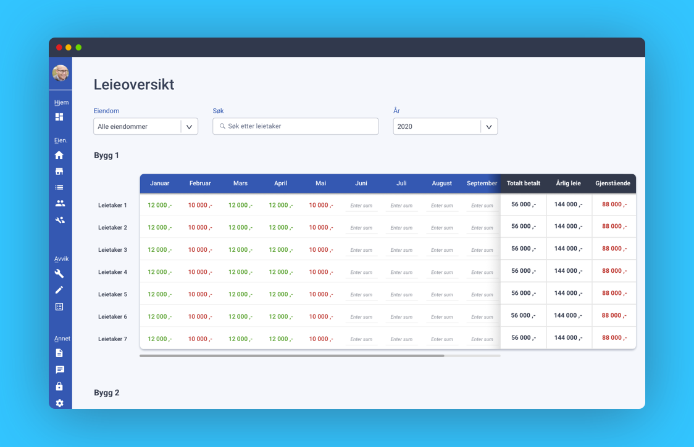

Da vi for første gang begynte å skissere våre idéer om Eiendomsappen for snart to år siden var det med to mål for øyet. Det ene var å sikre fornøyde leietakere som føler seg sett og hørt. Det andre var å effektivisere driften av bygg rundt om i det ganske land (snart også det ganske Europa). **Lite visste vi at vi også kom til å bli et verktøy som utleiere benytter for å håndtere en pandemi vi aldri kunne ha drømt om.**

<!--truncate-->

### Rapporter for å planlegge tiltak
Det tok ikke mange dagene etter at landet var snudd på hodet før vi fikk vår første e-post fra en av våre brukere. **De ville så raskt og enkelt som mulig få en oversikt over situasjonen hver enkelt leietaker befinner seg i, og de ville diskutere hvordan de skulle gjøre det med vår rapporterings-funksjon.** Noen dager senere begynte svarene fra leietakerne å tikke inn, til stor hjelp for denne utleieren som skulle planlegge målrettede tiltak for å hjelpe de leietakerne som trenger det mest.

[Les mer: Slik kommer du i gang med rapporter](../../../../docs/landlord_reports)

Under ser du et eksempel på hvordan en slik undersøkelse kan se ut, både fra utleieren og leietakerens perspektiv.

### 

### Avviksbehandling i krisetid

Rapporterings-funksjonaliteten har nærmest fått en renessanse i disse dager og brukes på måter vi aldri kunne sett for oss. Samtidig ser vi at avviks-funksjonaliteten virkelig har fått forsterket sin viktighet. **Man trenger ikke lenger å befinne seg på bygget for å ta del i, og organisere, driften.** Hvis et avvik oppdages av noen som er på en kjapp inspeksjon, får resten av organisasjonen all nødvendig informasjon om avviket. Bilder, status, historikk mm. gjør at flest mulig kan fortsette jobben som normalt hjemmefra. Effektiv drift har aldri vært viktigere.

### Oversikt over leieinntekter

Ukene vi er i nå er vanskelige for mange leietakere, og utleiere rundt omkring i landet setter i gang tiltak for å redusere tyngden på skuldrene til sine leietakere. For mange betyr det reduserte leieinntekter i en periode, noe som kan bli uoversiktlig i lengden. **På Eiendomsappen lanserer vi nå derfor en leieoversikt** (vist under) slik at du som utleier enkelt kan holde oversikt over hva hver leietaker har betalt av leie hver måned og hva som er utestående.

[Les mer: Slik kommer du i gang med leieoversikten](../../../../docs/landlord_incomeoverview)

### Eiendomsappen - for en enklere hverdag

For å hjelpe utleiere, leietakere og leverandører så langt det lar seg gjøre så blir det i disse dager pushet ut en god del oppdateringer fra vår side. Har du noen spørsmål, innspill, kommentarer eller bare vil ta en prat så er vi alltid tilgjengelige på [kontakt@eiendomsappen.com](mailto:kontakt@eiendomsappen.com) eller chatten på nettsiden.