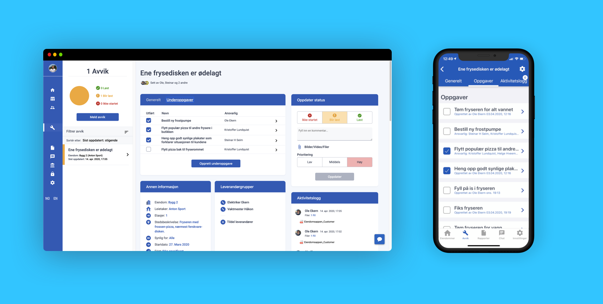
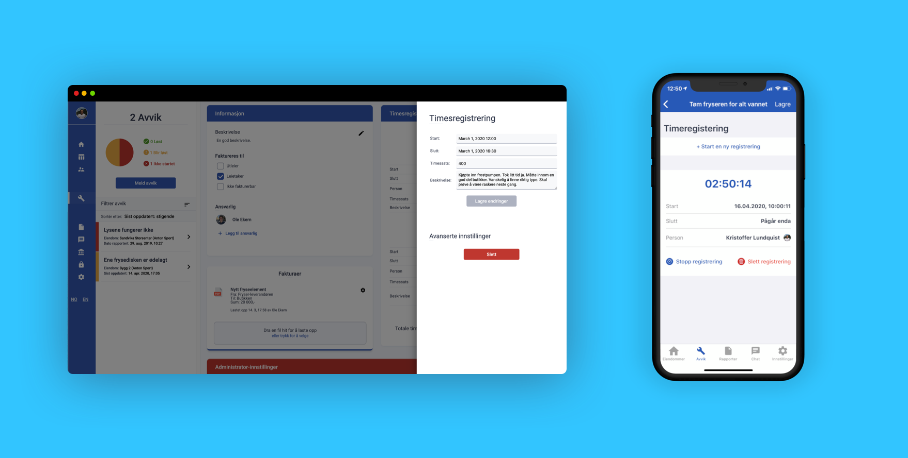
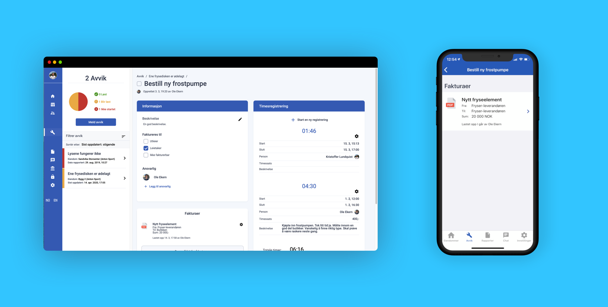

Noen avvik vokser seg så store at flere forskjellige oppgaver må utføres for at avviket skal kunne lukkes, og for å løse det problemet, **introduserer vi nå underoppgaver.** Underoppgaver er det nyeste tillegget til Eiendomsappen og lar utleiere, leverandører og andre driftsansvarlige opprette oppgaver som gjør det lett å føre timer, velge hvem som er ansvarlig for utførelse, legge ved faktureringsinformasjon og annet. Underoppgaver kan også brukes som sjekklister for arbeid på bygg og i disse dager forbereder vi et system som skal kunne opprette slike periodiske lister, automatisk.

<!--truncate-->

### Kan opprettes i løpet av et blunk
Underoppgaver er bygget på en ny teknologi som gjør at alt vil føles raskere - fordi det faktisk er det. **Å opprette oppgavene og administrere de er enkelt og effektivt**, og kan utføres av utleiere, leverandører og driftsansvarlige på alle platformer. Deretter kan man enkelt velge hvem som skal stå som ansvarlig for at oppgaven utføres, uansett om personen er en leietaker, utleier eller leverandør.

[Les mer: Slik oppretter du underoppgaver](../../../../docs/landlord_subtasks#opprette-en-underoppgave)

[Les mer: Slik velger du ansvarlige personer](../../../../docs/landlord_subtasks#velge-ansvarlige-personer)

### Registrer timer og få oversikt over utført arbeid

For å sikre god dokumentasjon av arbeid på avvik, er timeregistrering en essensiell del. **Timeregistreringen på Eiendomsappen lar ansvarlige for underoppgaven loggføre timer de har brukt på oppgaven**, ved å enkelt kunne starte/slutte registreringen rett fra appen, legge til en beskrivelse, timesats og mer. Dette gir utleiere oversikt og statistikk over alt arbeid som er utført på ulike avvik og gir en innsikt man tidligere aldri kunne drømt om.

[Les mer: Slik registrerer du timer](../../../../docs/landlord_subtasks#timeregistrering)

### Få kontroll over fakturering

Om arbeidet som utføres skal faktureres til utleier, leietaker eller ikke, varierer fra oppgave til oppgave. **Det er derfor enkelt å registrerer hvem som skal faktureres for arbeidet, i tillegg til å laste opp fakturaer, legge ved summer, beskrivelser og annet**. Dette kan enkelt lastes opp gjennom web-platformen vår og deretter sees gjennom alle platformer.

[Les mer: Slik laster du opp fakturaer](../../../../docs/landlord_subtasks#laste-opp-fakturaer)

### Eiendomsappen - for en enklere hverdag

For å hjelpe utleiere, leietakere og leverandører så langt det lar seg gjøre så blir det i disse dager pushet ut en god del oppdateringer fra vår side. Har du noen spørsmål, innspill, kommentarer eller bare vil ta en prat så er vi alltid tilgjengelige på [kontakt@eiendomsappen.com](mailto:kontakt@eiendomsappen.com) eller chatten på nettsiden.